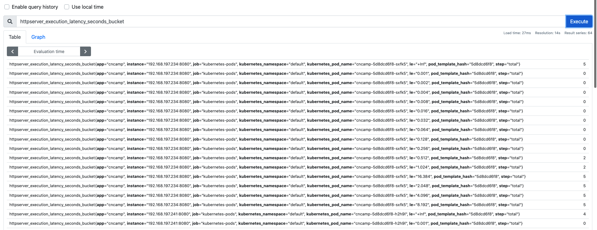
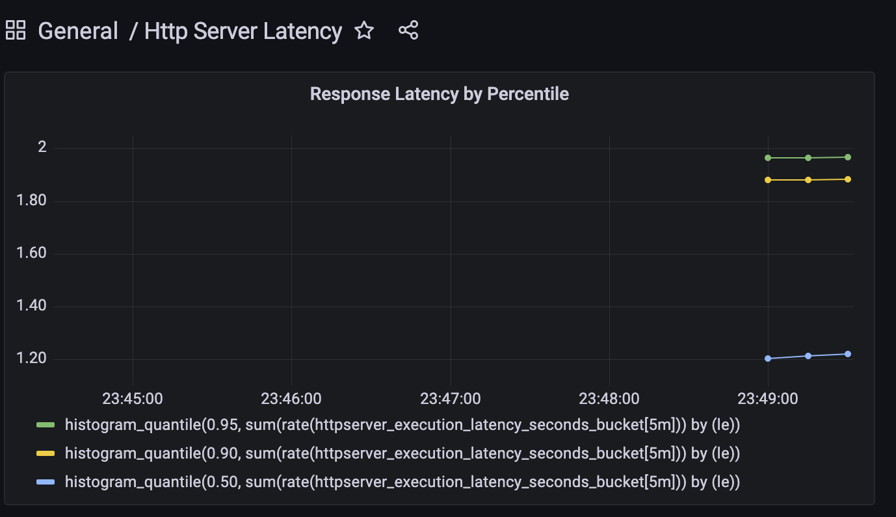

# Chap 10

## 1 and 2: 0-2 sec random delay and delay Metric
build the latest image first, instrument the app by following cncamp's sample and official doc here: https://prometheus.io/docs/guides/go-application/

## 3
```shell
k apply -f spec.yaml
```

install loki-prometheus stack: https://github.com/cncamp/101/tree/master/module10/loki-stack
```shell
helm upgrade --install loki grafana/loki-stack --set grafana.enabled=true,prometheus.enabled=true,prometheus.alertmanager.persistentVolume.enabled=false,prometheus.server.persistentVolume.enabled=false
```

found the version is too updated that incompatible, then follow cncamp's example here

download loki-stack
```shell
helm pull grafana/loki-stack
tar -xvf loki-stack-2.4.1.tgz
cd loki-stack

# replace all rbac.authorization.k8s.io/v1beta1 with rbac.authorization.k8s.io/v1 by
sed -i s#rbac.authorization.k8s.io/v1beta1#rbac.authorization.k8s.io/v1#g *.yaml
# install loki locally
helm upgrade --install loki ./loki-stack --set grafana.enabled=true,prometheus.enabled=true,prometheus.alertmanager.persistentVolume.enabled=false,prometheus.server.persistentVolume.enabled=false
````

## 4
check the metrics from Prometheus UI

edit the svc `loki-prometheus-server` from ClusterIP to NodePort first

then go to the `192.168.34.1:32552` to visit Prometheus



found the metrics are already there

## 5 create the dashboard on Grafana

get the login credential first 

```shell
k get secrets loki-grafana  -o jsonpath="{.data.admin-user}" | base64 -d

k get secrets loki-grafana  -o jsonpath="{.data.admin-password}" | base64 -d
```

edit the svc `loki-grafana` from ClusterIP to NodePort first

then go to the `192.168.34.1:31326` to visit Grafana

import the json to the grafana dashboard: https://github.com/cncamp/101/raw/master/module10/httpserver/grafana-dashboard/httpserver-latency.json

check the result
